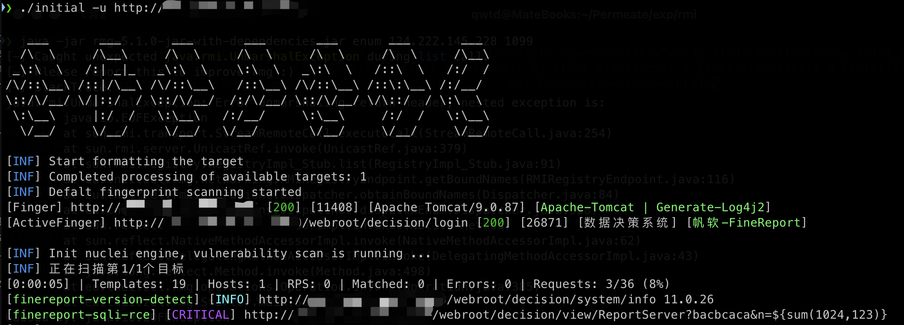

<h4 align="center">Slack cli for webscan</h4>

# Features



# Usage

````
initial -h
````

This will display help for the tool. Here are all the switches it supports.


```bash
NAME:
   initial - slack cli for webscan

USAGE:
   initial -u http://www.baidu.com

COMMANDS:
   help, h  Shows a list of commands or help for one command

GLOBAL OPTIONS:
   -u value         url
   -f value         url file
   -d               enable deepScan to check more fingerprints, e.g nacos xxl-job (default: true)
   --rp             does the deep fingerprint adopt root path scanning (default: true)
   --nopoc          don't call nuclei for vulnerability scanning (default: false)
   -t value         template file or directory (default: "./config/pocs")
   --thread value   fingerscan thread (default: 50)
   --timeout value  web timeout (default: 10)
   --debug          show request and response data packet (default: false)
   --proxy value    set proxy, e.g: http://127.0.0.1:8080 | sock://127.0.0.1
   --help, -h       show help
   --version, -v    print the version
```

# Download Config

需要将release中的config.zip解压到当前工具路径才能正常使用，后续更新配置文件也是如此

